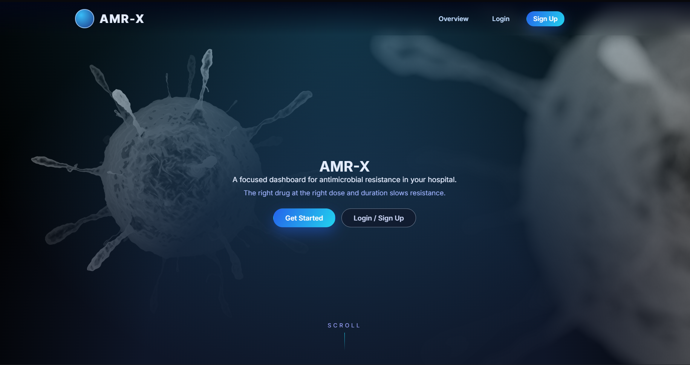
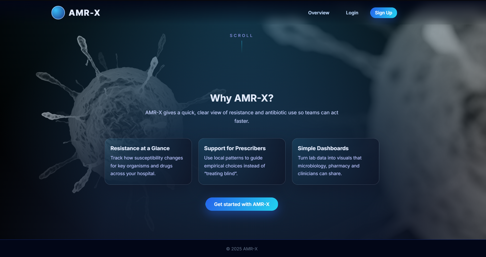

# 🧬 AMR-X  
### Antimicrobial Resistance Surveillance & Analytics Platform

**AMR-X** is an academic prototype for **district-level antimicrobial resistance (AMR) surveillance**.  
It combines **ML-derived resistance probabilities** with **hospital pharmacy and laboratory-linked usage events** to compute a **Resistance Weighted Usage Index (RWUI)** for public-health analytics and early warning.

---

## 🚨 Why AMR-X?

Antimicrobial resistance is a **silent epidemic**, especially in regions where laboratory surveillance is sparse, delayed, or fragmented.

AMR-X addresses this gap by:

- Anchoring surveillance to **ML-estimated resistance probabilities**
- Aggregating **hospital pharmacy & lab-associated usage events**
- Producing **district-level resistance pressure indicators (RWUI)**
- Visualizing trends via **dashboards and heatmaps**

> ⚠️ **AMR-X models resistance pressure, not confirmed resistance incidence.**

---

## 🧠 Core Concept

- Resistance signals are **estimated**, not diagnosed  
- ML provides **baseline risk anchoring**
- Aggregation over time enables **trend detection**
- Lab-confirmed resistance is a **future refinement layer**

---

## 🏥 System Assumption (Prototype Scope)

This prototype assumes an **integrated hospital environment** where:

- Microbiology lab outputs are accessible to the pharmacy information system  
- Antibiotic usage events are traceable at hospital or district level  

AMR-X **does NOT assume retail pharmacists manually identifying organisms**.

---

## ✨ Key Features

### 🔹 District-Level AMR Analytics
- RWUI (Resistance Weighted Usage Index)
- Risk levels: **Low / Medium / High / Critical**
- Time-windowed trend analysis
- Antibiotic contribution breakdowns

### 🔹 ML-Anchored Resistance Estimation
- Global AMR dataset–trained model
- Probability-based resistance estimates
- Used for **risk anchoring**, not diagnosis

### 🔹 Interactive Dashboards
- Hospital Pharmacy Dashboard
- District Surveillance Dashboard
- Kerala district AMR heatmaps
- Organism & antibiotic analytics

### 🔹 Secure Backend
- Supabase (PostgreSQL + Auth)
- JWT-based authentication
- Row-level security (RLS)
- Environment-secured secrets

---

## 🧩 System Architecture

[ Hospital / Lab Systems ]
|
v
[ Surveillance Data Ingestion ]
|
v
[ Backend API (Node.js + Supabase) ]
|
v
[ ML Inference Engine ]
|
v
[ RWUI / Resistance Pressure Analytics ]
|
v
[ Dashboards & Heatmaps ]

---

## 🖥️ Screenshots

> All screenshots are stored in `src/assets/`

### 🏠 Home & Navigation

---

### 👤 User Dashboard

---

### 📊 Analytics Dashboard

---

### 🏥 Hospital Pharmacy Logs

---

### 🧪 Integrated Pharmacy Environment

---

### 📈 Data Ingestion

---

### 🗺️ District Heatmap (Kerala)

---

### 🔐 Portal & Auth

---

## 🧮 RWUI Definition

RWUI = Average ML-estimated resistance probability
across antibiotic usage events
within a district and time window

Range: 0 → 1
Represents resistance pressure
Not equivalent to lab-confirmed resistance rates

---

## 🛠️ Tech Stack

### Frontend
- HTML, CSS, JavaScript
- Chart.js
- Leaflet.js (maps)

### Backend
- Node.js
- Supabase (PostgreSQL + Auth)
- REST APIs

### Machine Learning
- External inference service
- Global AMR dataset
- Probability-based predictions

---

## 🔐 Security & Secrets

- Secrets stored in `Backend/.env`
- `.env*` excluded via `.gitignore`
- No hardcoded credentials
- Supabase Row-Level Security enforced

---

## 🚀 Future Enhancements

- Hospital LIS integration
- Longitudinal resistance modeling
- Antibiotic stewardship alerts
- Multi-state / national surveillance
- Lab-confirmed outcome weighting

---

## 👥 Project Context

Developed as an **academic prototype** focused on:

- AMR surveillance
- Health analytics
- ML-assisted public-health decision support

---

## 📜 License

Released for **academic and demonstration purposes**.  
(Add an MIT License if you plan to open-source.)

---

**AMR-X — Turning antibiotic usage into early resistance intelligence.**
